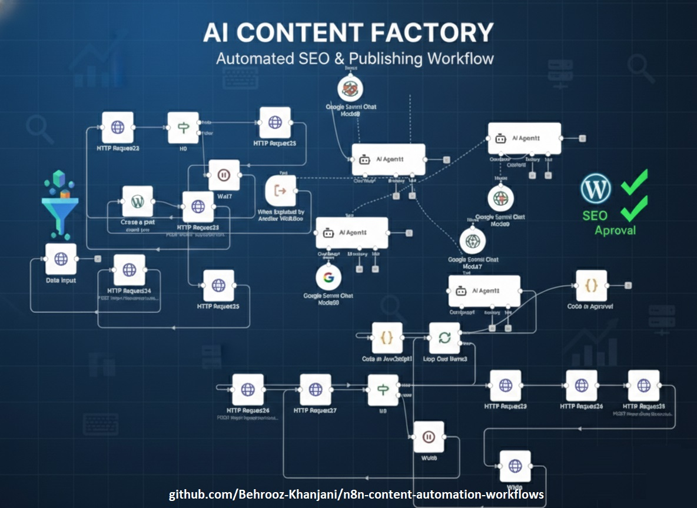

# ✍️ Automated AI Content Factory & SEO Writer

## 🚀 What is this project?
This is a fully automated system that writes and publishes high-quality blog posts. It works like a robot writer for WordPress websites.

Instead of writing articles manually, this workflow uses **Google Gemini AI** to research, write, and optimize content for Google Search (SEO). It runs automatically every day or week.

## ✨ Key Features (Why it is smart?)
* **🔎 Smart Research:** It searches the web to find trending topics and accurate information.
* **🤖 Multi-Agent AI:** It uses different AI agents. One agent writes the draft, and another agent checks the quality and SEO.
* **✅ SEO Optimized:** It writes titles, meta descriptions, and uses keywords correctly to rank higher on Google.
* **Wordpress Integration:** It automatically formats the text and publishes it directly to the WordPress site.
* **Structured Data:** It creates clean data format (JSON) for better system processing.

## 🛠️ How it works
1.  **Trigger:** The system starts on a schedule (e.g., every morning).
2.  **Generation:** Google Gemini AI writes the article based on keywords.
3.  **Review:** A second AI layer reviews the text to make it sound human and professional.
4.  **Publish:** The workflow sends the final post to WordPress.
5.  **Index:** (Optional) It pings search engines to index the new page faster.

## 💻 Tools Used
* **n8n** (Automation)
* **Google Gemini Pro** (AI Model)
* **WordPress API**
* **HTTP Requests**

---
**Note:** *The source code (JSON) for this workflow is private because it uses advanced prompt engineering techniques. I am happy to show a live demo in an interview.*

**Created by Behrooz Khanjani**
