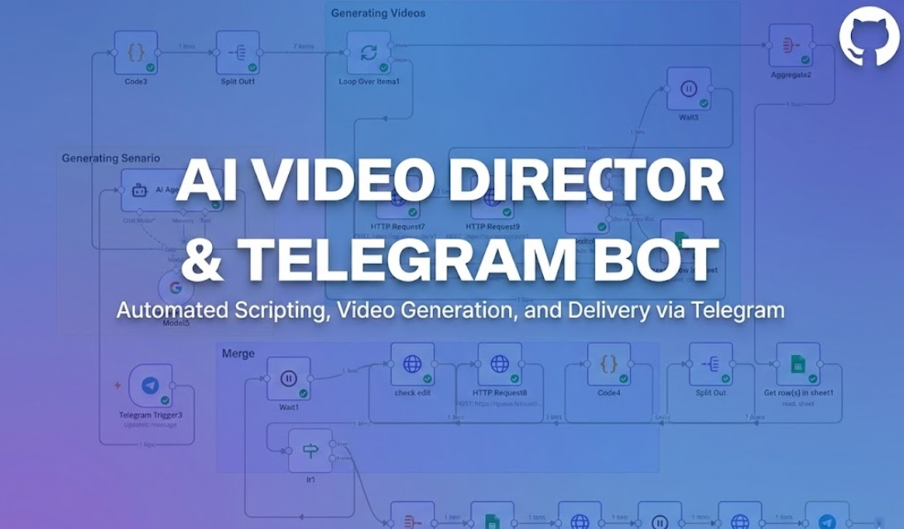

# 🎬 AI Video Director & Telegram Bot

## 🎥 Project Overview
This is a fully automated **"Text-to-Video"** factory inside Telegram. It acts like a movie director: you send a text idea, and the AI writes the script, creates the scenes, and delivers a generated video back to you.

It solves the complex problem of handling **long video generation times** inside a chat bot using a smart queue system.

## ✨ Key Features
* **🎭 Smart Scripting:** Uses **Google Gemini AI** to turn simple ideas into detailed, professional video prompts.
* **🔄 Automated Looping:** It splits the script into multiple scenes and generates them one by one automatically.
* **⏳ Smart Queue System:** Video generation takes time. This workflow uses a "Polling Mechanism" to wait and check the status without crashing the bot.
* **📊 Live Status Tracking:** Uses **Google Sheets** to track which videos are rendering and which are finished.
* **Telegram Interface:** The user never leaves Telegram; everything happens in the chat.

## ⚙️ How It Works (The Logic)
1.  **User Input:** You send a message (e.g., *"A futuristic car in rain"*) to the bot.
2.  **AI Processing:** Gemini AI converts this into a technical video prompt.
3.  **API Request:** The workflow sends the prompt to a Video Generation AI (like Kling/Runway/Luma).
4.  **Waiting Loop:** The system checks the API every few seconds to see if the video is ready.
5.  **Delivery:** Once ready, the video file is downloaded and sent to your Telegram chat.

## 🛠️ Tech Stack
* **Orchestration:** n8n
* **AI Brain:** Google Gemini Pro
* **Video Engine:** External Video Generation API
* **Database:** Google Sheets
* **Interface:** Telegram Bot API

---
**Note:** *This project demonstrates advanced backend logic, including loops, asynchronous API handling, and state management. The source code is available for technical review.*

**Created by Behrooz Khanjani**
