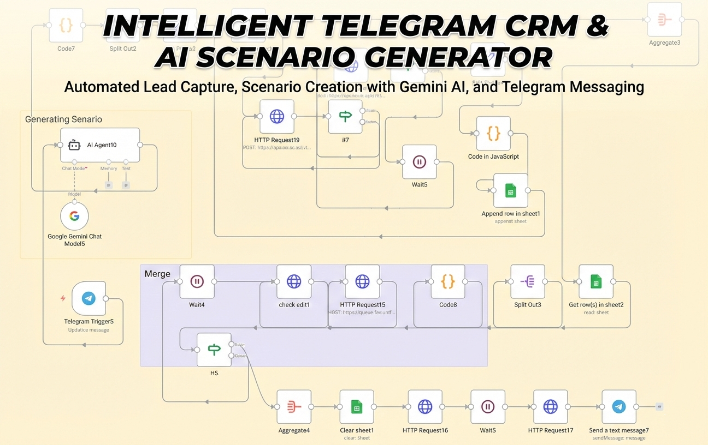

# 🤖 Intelligent Telegram CRM & AI Scenario Generator

## 🚀 Project Overview
This project is an advanced **n8n workflow** designed to automate customer interactions and lead management on Telegram using Generative AI. It acts as an intelligent bridge between user inputs, AI processing, and database management.

Instead of simple static responses, this system uses **Google Gemini AI** to understand context, generate dynamic scenarios, and automatically categorize user data into a CRM (Google Sheets).

## 💡 Key Features
- **🧠 AI-Powered Conversations:** Utilizes `Google Gemini Pro` to analyze user intent and generate human-like responses.
- **📊 Automated CRM (Lead Capture):** Automatically extracts user details and conversation history, storing them in **Google Sheets** for further analysis.
- **twisted_rightwards_arrows: Dynamic Routing:** Uses JavaScript logic nodes to route users based on their requests (e.g., Support vs. Sales vs. General Inquiry).
- **📝 Scenario Generation:** The AI creates custom scenarios for users on the fly, making the interaction highly personalized.
- **🔄 Loop & Aggregation:** Handles multiple inputs and aggregates data before final processing to ensure data integrity.

## 🛠️ Tech Stack & Integrations
* **Workflow Engine:** [n8n](https://n8n.io/)
* **AI Model:** Google Gemini (PaLM/Pro models)
* **Messaging Platform:** Telegram Bot API
* **Database/CRM:** Google Sheets API
* **Scripting:** JavaScript (for complex logic within n8n nodes)

## 🔄 Workflow Logic
1.  **Trigger:** Listens for incoming messages via Telegram Webhook.
2.  **AI Analysis:** The input is sent to an AI Agent to determine the intent and generate a relevant scenario.
3.  **Data Handling:**
    * If it's a new lead, data is appended to the Sheet.
    * If it's an existing user, their status is updated.
4.  **Response:** The processed AI response is sent back to the user on Telegram.

---
**Note:** *Due to the proprietary nature of the prompt engineering and logic used in this project, the source JSON code is not publicly available in this repository. I would be happy to provide a live demo or discuss the architecture in a technical interview.*

**Created by Behrooz Khanjani**
